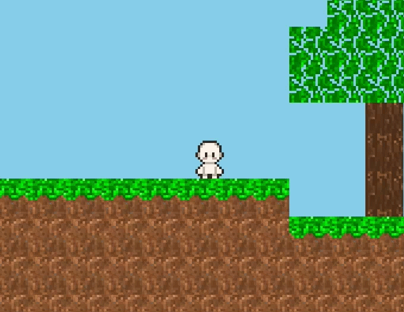

<div align="center">
<h1>🌅 Tiny Horizons</h1>

[![Python][python-image]][python-url] [![Pygame][pygame-image]][pygame-url] [![PyOpenGL][gl-image]][gl-url] [![Commits][commit-image]][commit-url] [![Created at][birth-image]][birth-url] [![License][license-image]](LICENSE)



</div>

Tiny Horizons is a small 2D tile-based sandbox game inspired by Terraria, built from scratch with Python, Pygame, and PyOpenGL.

## ✨ Features

- **🚀 Physics-based movement system** - Realistic collision, gravity, acceleration, friction, and jump mechanics
- **👾 Animation using spritesheets** - Smooth player animations with idle, walking, and aerial states, syncing with movement
- **⛏️ Various block types** - Different blocks such as grass, dirt, logs, stone, coal, and leaves
- **📦 Chunk-based world management** - Chunk texture baking and queued world generation improve rendering and world-generation performance
- **⚙️ OpenGL renderer** - GPU-accelerated rendering using PyOpenGL to improve graphical performance
- **🎮 Interactive world** - Real-time block placing and breaking with visual feedback
- **🖼️ Asset management** - Images, spritesheets, and texture atlases are loaded and cached separately
- **🌍 Procedural terrain generation (experimental)** - Infinite worlds created using Perlin noise

## 🛠️ Installation and Usage

If you want to run the project locally, I recommend using **Python 3.12**. Python dependencies are automatically handled, so don't worry about pre-installing them. Run the following:

### 1. Clone the repository

```bash
git clone https://github.com/true-pro-grammer/tiny-horizons
cd tiny-horizons
```

### 2. Set up virtual environment

#### Linux / macOS

```bash
python3.12 -m venv .venv
source .venv/bin/activate
```

> 🛈 `activate` only works on POSIX-compatible shells such as **bash** and **zsh**. If you use **fish**, use `source .venv/bin/activate.fish` and if you use **csh** or **tcsh**, use `source .venv/bin/activate.csh`

#### Windows (Command Prompt)

```bash
py -3.12 -m venv .venv
.venv\Scripts\activate
```

#### Windows (PowerShell)

```bash
py -3.12 -m venv .venv
.venv\Scripts\Activate.ps1
```

### 3. Usage

If you wish to contribute, run `python -m pip install -e .` to install in editable mode, otherwise run `python -m pip install .`

> 🛈 You will need a C compiler to compile the `noise` package. You may already have this, but if prompted, install **Build Tools for Visual Studio** with the **Desktop development with C++ workload** (Windows). On Linux, install your distribution's standard development tools, such as `build-essential` on Debian/Ubuntu. On macOS, install **Xcode Command Line Tools**.

Now the program files and dependencies will be installed. You can run the game with `python main.py`.

To leave the virtual environment, you will have to run `deactivate`. Note that to run the game again you will have to first enter the venv again with either `source .venv/bin/activate` or `.venv\Scripts\activate` depending on your operating system. This is described in the previous step.

## 🤝 Credits

- 🎨 Spritesheets made by [Eris Esra](https://erisesra.itch.io/)
  - Assets: [Character Template Pack](https://erisesra.itch.io/character-templates-pack)
  - Twitter/X: [@ErisEsra_](https://x.com/ErisEsra_)

[python-image]: https://img.shields.io/badge/Python-3.12-blue?logo=python&logoColor=white
[python-url]: https://www.python.org/
[pygame-image]: https://img.shields.io/badge/pygame-2.6.1-green
[pygame-url]: https://www.pygame.org/docs/
[gl-image]: https://img.shields.io/badge/PyOpenGL-3.1.10-blue?logo=opengl&logoColor=white&logoSize=auto
[gl-url]: https://pypi.org/project/PyOpenGL/
[commit-image]: https://img.shields.io/github/commit-activity/t/true-pro-grammer/tiny-horizons?logo=github&logoColor=white&logoSize=auto&color=orange
[commit-url]: https://github.com/true-pro-grammer/tiny-horizons/commits/
[birth-image]: https://img.shields.io/github/created-at/true-pro-grammer/tiny-horizons?logo=github&logoColor=white&logoSize=auto&color=orange
[birth-url]: https://github.com/true-pro-grammer/tiny-horizons/pulse?period=monthly
[license-image]: https://img.shields.io/badge/MIT%20License-gray